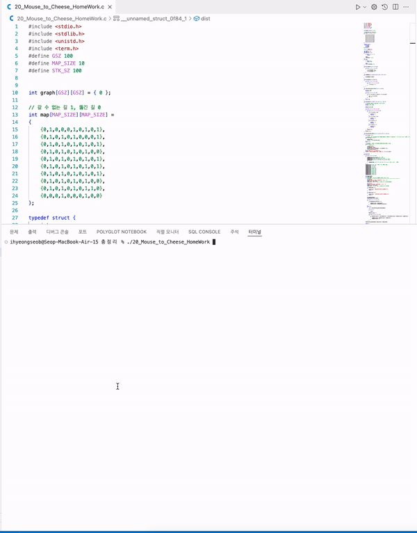

# INU 2학년 1학기 데이터구조. 핵심 내용 정리

## Recursion ##

## SLL ##
1. add a node
2. delete all nodes
3. print all nodes
4. print all nodes in reverse order
5. delete a node
6. insert a node before a number
7. insert a node after a number

## DLL ##
1. add a node
2. delete all nodes
3. print all nodes
4. print all nodes in reverse order
5. delete a node
6. insert a node before a number
7. insert a node after a number

## stack & queue ##

* push & pop
* enqueue & dequeue

## stack DLL ##
## Queue DLL ##

## BST ##
1. add a node
2. search a node
2. the number of all nodes
3. the number of leaf nodes
4. height
5. print all nodes of BST (inorder,preorder,postorder)
6. delete a node

## Heap ##

## Sort ##
1. selection
2. insertion
3. bubble
4. shell
5. merge
6. quick

## Graph ##
1. DFS
2. BFS

## Minimum Spanning Tree ##

1. Prim algorithm
2. Kruskal algorithm
``` c
// prepare graph
addEdge(graph, 0, 1, 100);
addEdge(graph, 0, 2, 10);
addEdge(graph, 1, 2, 1);
addEdge(graph, 1, 3, 1);
addEdge(graph, 1, 4, 15);
addEdge(graph, 2, 3, 1);
addEdge(graph, 3, 4, 1);
```


## 최단경로 ##
1. Dijkstra algorithm
``` c
// prepare graph
int graph[NV][NV] = {
		//   0   1  2  3  4  5  6
			{-1,-1,-1,-1,-1,-1,-1}, // 0
			{-1,-1,3,-1,15,-1,-1}, // 1
			{-1,3,-1,30,2,-1,-1}, // 2
			{-1,-1,30,-1,-1,3,4}, // 3
			{-1,15,2,-1,-1,1,-1}, // 4 
			{-1,-1,-1,3,1,-1,20}, // 5
			{-1,-1,-1,4,-1,20,-1}, // 6
	};
```
2. Ford algorithm
``` c
// prepare graph
int graph[NV][NV] = {
		{9999,4,1,9999,9999,9999,9999},
		{4,9999,3,9999,15,9999,9999},
		{1,3,9999,30,2,9999,9999},
		{9999,9999,30,9999,9999,3,4},
		{9999,15,2,9999,9999,1,9999},
		{9999,9999,9999,3,1,9999,20},
		{9999,9999,9999,4,9999,20,9999}
	};
```

## Topological sort ##
```
// prepare graph
int graph[NV][NV] = {
		{0,0,1,1,0,0},    // 0에서 2가는 edge, 0에서 3가는 edge
		{0,0,0,1,1,0},	  // 1에서 3가는 edge, 1에서 5가는 edge
		{0,0,0,0,0,1},
		{0,0,0,0,0,1},
		{0,0,0,0,0,1},	  // 4에서 5가는 edge
		{0,0,0,0,0,0}	  // 5에서 가는 edge는 없다
	};
```

## Hashing ##
1. add a node
2. delete a node
3. search a node
4. print hash table
--------------------------------------------

## 20_Mouse_to_Cheese_HomeWork.c

* The problem of a mouse finding the shortest path to the cheese (Dijsktra algorithm)
